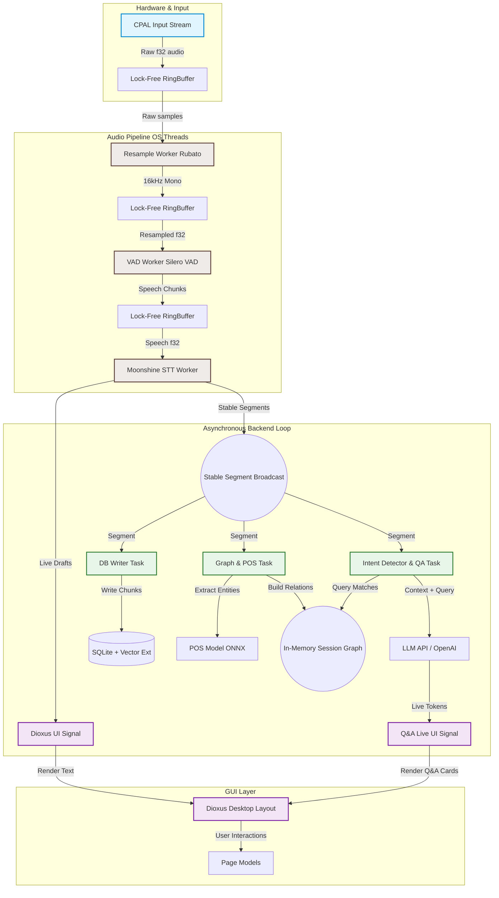

# Tayori

<p align="center">
  
</p>

<h3 align="center">Tayori</h3>

<p align="center">
  A high-performance, real-time desktop meeting assistant and session co-pilot built in Rust.
</p>

<p align="center">
  <a href="https://github.com/nthnf/tayori"></a>
  <a href="https://dioxuslabs.com/"></a>
  <a href="https://onnxruntime.ai/"></a>
  <a href="https://sqlite.org/"></a>
  <a href="https://github.com/nthnf/tayori/blob/main/LICENSE"></a>
</p>

---

## 📖 Project Overview

**Tayori** is a real-time desktop companion that sits in your workspace, capturing audio from your meetings (system audio monitor or physical microphone) to transcribe speech locally, index chunks semantically, and leverage LLMs to answer context-aware questions dynamically as they happen.

It demonstrates production-grade systems engineering in Rust, low-latency audio processing pipelines, local Machine Learning (ML) inference, and a highly responsive desktop GUI.

> [!IMPORTANT]  
> All audio processing, resampling, and VAD/STT feature extraction run fully locally on your device for absolute privacy.

---

## ⚡ Core Pipeline & Architecture

Tayori utilizes a decoupled, multi-threaded worker architecture to ensure hardware audio captures run with zero latency and the UI remains highly responsive.



---

## 🛠️ Technology Stack & System Specs

| Domain               | Technology                   | Purpose                                                               |
| :------------------- | :--------------------------- | :-------------------------------------------------------------------- |
| **System Language**  | Rust (Edition 2024)          | Type-safe, memory-safe backend engine with zero-cost abstractions     |
| **Desktop GUI**      | Dioxus 0.7 + Tailwind        | Responsive, hardware-accelerated desktop view using native webviews   |
| **Audio Capture**    | `cpal` + `pipewire` / `alsa` | High-fidelity multi-channel input device abstraction & monitoring     |
| **Audio Resampling** | `rubato` (Sinc Resampler)    | Real-time asynchronous conversion to 16kHz mono audio                 |
| **VAD Inference**    | Silero VAD (ONNX)            | Local, deep-learning based voice activity boundary detection          |
| **Local STT**        | Moonshine STT (ONNX)         | High-accuracy local speech-to-text decoding                           |
| **POS & Entities**   | MobileBERT POS (ONNX)        | `mrm8488/mobilebert-finetuned-pos` for entity extraction              |
| **Context Memory**   | In-Memory Session Graph      | High-performance semantic relation mapping during active sessions     |
| **Embeddings**       | FastEmbed                    | Fast, native execution of local text embedding models                 |
| **Database**         | SQLite + `sqlite-vector`     | FTS5 matched with `sqliteai/sqlite-vector` similarity search          |
| **ORM Framework**    | SeaORM                       | Safe, structured ActiveRecord DB mappings                             |
| **Async Executor**   | Tokio (Multi-threaded)       | Non-blocking thread scheduling and database/IO multiplexing           |

---

## ✨ Features Walkthrough

- **Warm Model Caching:** Heavy Machine Learning models (Moonshine STT, Silero VAD, TinyBERT) are cached warm inside a global `AppState` on startup, allowing sessions to start and pause instantly (<1ms latency) without reloading files from disk.
- **Leak-Free Session Boundaries:** Built around a custom broadcast signal loop (`session_stop_tx`), Tayori shuts down and drops old database tasks on session end to prevent resource leaks and transcript data contamination.
- **Intelligent Contextual Q&A:** Automatically detects query intents using TinyBERT, builds an in-memory knowledge graph of entities mentioned via a custom POS model, and injects relevant context into LLMs to generate real-time answers.
- **Persistent Dashboard:** Track history, view document vectors, manage project configurations, and delete or update sessions dynamically.

---

## 📁 Project Structure

```
tayori-v2/
├── assets/                # Stylesheets, custom fonts, favicon
├── migration/             # SeaORM database migrations setup
├── sqlite-extension/      # Custom SQLite vector search native extension
├── src/
│   ├── backend/           # Core processing, audio workers, and controllers
│   │   ├── audio/         # CPAL capture, resampler, Silero VAD, Moonshine STT workers
│   │   ├── entities/      # Generated database schema mappings
│   │   ├── models/        # ML model download helpers, tokenizers, LLM API client
│   │   └── pages/         # Page controllers that isolate database and background tasks
│   ├── components/        # Reusable Dioxus UI components (Nav bar, Theme state)
│   ├── pages/             # Frontend UI views (Dashboard, Live page, Settings)
│   ├── state.rs           # Global AppState (Database context, warm model caches)
│   ├── lib.rs             # Library router, types, and module declarations
│   └── main.rs            # Application entry point & database initializer
├── Cargo.toml             # Package manifest & dependencies
└── Dioxus.toml            # Desktop framework configurations
```

---

## ⚙️ Setup & Installation

> [!NOTE]  
> Audio driver development headers are required for local capture. Ensure `pipewire` or `alsa` development libraries are installed.

```bash
# 1. Clone the repository
git clone https://github.com/nthnf/tayori.git
cd tayori

# 2. Install the Dioxus CLI
cargo install dioxus-cli

# 3. Compile and launch the application
dx serve --platform desktop
```

---

## ⚖️ Legal Disclaimer

### Educational Purpose Only

This project is created **strictly for educational and self-learning purposes**. It is designed to demonstrate advanced concepts in Rust systems programming, real-time asynchronous pipelines, low-latency audio capture, and local machine learning integration.

### Wiretapping & Recording Consent

Depending on your jurisdiction, recording system audio, microphone capture, or meetings without the explicit consent of all participants may violate wiretapping, privacy, or recording laws (e.g., Two-Party or All-Party Consent laws).

- **Consent:** You are solely responsible for obtaining all necessary consents before recording any conversation, call, or meeting using this software.
- **Use-Case Limitations:** The author does not condone, encourage, or support the unauthorized or illegal interception of communication.

### Limitation of Liability & Warranty

THE SOFTWARE IS PROVIDED "AS IS", WITHOUT WARRANTY OF ANY KIND, EXPRESS OR IMPLIED, INCLUDING BUT NOT LIMITED TO THE WARRANTIES OF MERCHANTABILITY, FITNESS FOR A PARTICULAR PURPOSE, AND NONINFRINGEMENT. IN NO EVENT SHALL THE AUTHORS OR COPYRIGHT HOLDERS BE LIABLE FOR ANY CLAIM, DAMAGES, OR OTHER LIABILITY, WHETHER IN AN ACTION OF CONTRACT, TORT, OR OTHERWISE, ARISING FROM, OUT OF OR IN CONNECTION WITH THE SOFTWARE OR THE USE OR OTHER DEALINGS IN THE SOFTWARE. The author assumes no legal responsibility, obligation, or liability for any misuse, legal violations, data loss, or system damage resulting from compiling, running, or modifying this project.
